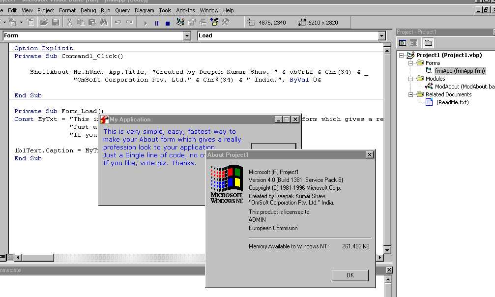



## Single Line About Box

### Description

This is very simple, easy, fastest way to make your About from which gives a really profession look to your application.

Just a Single line of code, no over heads.

If you like, vote plz. Thanks.
 
### More Info
 
String

Form

             |
---                |---
**Submitted On**   |2003-06-11 16:34:06
**By**             |[Deepak Kumar Shaw](https://github.com/Planet-Source-Code/PSCIndex/blob/master/ByAuthor/deepak-kumar-shaw.md)
**Level**          |Intermediate
**User Rating**    |4.0 (8 globes from 2 users)
**Compatibility**  |VB 4\.0 \(32\-bit\), VB 5\.0, VB 6\.0
**Category**       |[Custom Controls/ Forms/  Menus](https://github.com/Planet-Source-Code/PSCIndex/blob/master/ByCategory/custom-controls-forms-menus__1-4.md)
**World**          |[Visual Basic](https://github.com/Planet-Source-Code/PSCIndex/blob/master/ByWorld/visual-basic.md)
**Archive File**   |[Single\_Lin1599736122003\.zip](https://github.com/Planet-Source-Code/deepak-kumar-shaw-single-line-about-box__1-46114/archive/master.zip)

